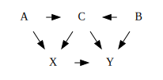

# Statistical Rethinking #1: The Golem of Prague

## Causal Inference

Bayesian vs. Frequentism wars are over. New fight is causal inference.

> Causal inference is the process of using statistical methods to identify and
> understand the relationships between variables, with the goal of determining
> the cause and effect of these relationships. In other words, causal inference
> involves using statistical techniques to establish that a change in one
> variable (the cause) is responsible for a change in another variable (the
> effect).

## Directed Acyclic Graphs (DAGs)

Abstract causal models (heuristic).

> A directed acyclic graph (DAG) is a type of graph that consists of a set of
> vertices (also called nodes) and a set of directed edges connecting the
> vertices. The edges in a DAG are directed, meaning that they have a specific
> starting point and ending point, and they do not form cycles, meaning that
> there is no way to follow the edges in the graph and return to the same
> starting point.

### Use Cases for DAGs

- Modeling complex systems: DAGs can be used to represent and analyze the
  relationships between different components or stages in a complex system.

- Visualizing data dependencies: DAGs can be used to visualize and understand
  the dependencies between different variables or data sources.

- Analyzing cause and effect: DAGs can be used to identify and understand the
  relationships between different variables, and to identify the potential
  causes and effects of those relationships.

- Evaluating interventions or treatments: DAGs can be used to model the
  potential impacts of different interventions or treatments on a system, and
  to evaluate the effectiveness of those interventions.

## Golems

> The word "golem" is derived from the Hebrew word "gelem," which means "raw
> material." In Jewish folklore, a golem is a magical being or creature, often
> made of clay, that is animated and brought to life through the use of magic
> or science.

### Golem Myth

The legend of the clay golem is a folklore story that originated in the Jewish
community of Prague in the 16th century. According to the legend, the clay
golem was a giant humanoid creature made of clay, which was animated through
the use of a magical word written on a piece of parchment placed under its
tongue. The clay golem was said to be created to protect the Jewish community
of Prague from persecution and violence.

The legend of the clay golem has a number of different versions, but one of the
most famous versions tells the story of a rabbi named Judah Loew ben Bezalel,
who is said to have created the clay golem to defend the Jewish community of
Prague from attacks by anti-Semitic mobs. According to the legend, the clay
golem was brought to life using a combination of magic and science, and it was
programmed to follow the orders of its creator.

The legend of the clay golem has been adapted and reinterpreted in various
forms over the years, including in literature, film, and popular culture. It is
often seen as a metaphor for the power of science and technology to protect and
defend against danger, as well as a symbol of the resilience and strength of
the human spirit.

## Owls

- Step 1: Draw some circles
- Step 2: Draw the rest of the owl.

### Drawing the Bayesian Owl

1. Understand what you're doing.
1. Document your work, reduce error.
1. Respectable scientific workflow.

## Glossary

- Heuristic: A heuristic is a mental shortcut or rule of thumb that people use
  to solve problems or make decisions quickly and efficiently.
- Latent variables: Latent variables are variables that are not directly
  observed, but are inferred from the relationships between other variables.
- Measurement error: Measurement error refers to the difference between a
  measured value and the true value of a quantity.
- Missing data: Missing data refers to observations that are not included in a
  dataset due to various reasons, such as incomplete record keeping or data
  collection errors.
- Regularization: Regularization is a method used to reduce the complexity of a
  model and prevent overfitting by adding a penalty term to the objective
  function during optimization.
- Theoretical estimand: A theoretical estimand is a quantity of interest in a
  statistical model that is defined in terms of the underlying population
  parameters, and is used to guide the estimation of these parameters.

## Endnotes

### Statistical Schools

Frequentist statistics is based on the idea that statistical inference should
be based on the frequency of events or outcomes in a sample, with the goal of
making predictions or drawing conclusions about a population. In frequentist
statistics, probability is used to represent the long-term relative frequency
of an event or outcome, and statistical conclusions are based on the assumption
that the sample is representative of the population.

Bayesian statistics is based on the idea that statistical inference should be
based on the principles of probability theory, with the goal of making
predictions about the future based on past data. In Bayesian statistics,
probability is used to represent the degree of belief in an event or
hypothesis, and statistical models are updated or revised based on new data.

### Bayesian Example

Imagine that you are trying to estimate the probability that it will rain
tomorrow based on past weather data. You have data on the weather for the past
100 days, and you know that it rained on 20 of those days. You can use this
data to estimate the probability of rain tomorrow using Bayesian statistics.

First, you would need to specify a prior probability distribution for the
probability of rain, based on your initial beliefs about the likelihood of
rain. For example, you might specify a uniform distribution between 0 and 1,
which represents the fact that you have no strong prior beliefs about the
probability of rain.

Next, you would use Bayes' theorem to update your prior distribution based on
the data you have collected. In this case, you would use the data on the number
of rainy days to update your prior distribution and calculate the posterior
distribution for the probability of rain.

Finally, you would use your posterior distribution to make a prediction about
the probability of rain tomorrow. Based on your updated distribution, you might
conclude that there is a 40% chance of rain tomorrow.

### Sir Ronald Aylmer Fisher

Sir Ronald Aylmer Fisher (1890-1962) was a British statistician and geneticist
who is considered one of the founders of modern statistics. Fisher was born in
East Finchley, London, and he received his undergraduate education at
University College, London. He went on to pursue graduate studies at Cambridge
University, where he developed an interest in statistical theory and
methodology.

Fisher is best known for his contributions to statistical hypothesis testing,
experimental design, and the analysis of variance. He developed a number of
statistical tests, including the F-test, which is used to compare the variances
of two or more populations, and the t-test, which is used to determine whether
the mean of a sample is significantly different from a hypothesized mean.

In addition to his contributions to statistical theory, Fisher also made
important contributions to the field of genetics. He developed a statistical
model for the inheritance of traits, which became known as the "Fisherian
model," and he made important contributions to the understanding of
evolutionary processes and the genetics of populations.

Fisher received numerous awards and honors for his contributions to science,
including the Order of Merit, the Royal Society's highest honor, and he was
knighted in 1952. He is remembered as one of the pioneers of modern statistics
and as a major figure in the development of the scientific method.

### William Sealy Gosset

William Sealy Gosset (1876-1937) was a British statistician and brewer who is
best known for his work on statistical hypothesis testing and the analysis of
small data sets. Gosset was born in Canterbury, England, and he received his
education at Oxford University. After completing his studies, he took a job as
a brewer at the Guinness Brewery in Dublin, Ireland, where he developed an
interest in statistical analysis.

Gosset is best known for his development of the t-test, a statistical test used
to determine whether the mean of a sample is significantly different from a
hypothesized mean. The t-test is widely used in statistical analysis and
research, and it has had a lasting impact on a wide range of fields. Gosset's
work on the t-test was published under the pseudonym "Student" in order to
avoid violating the terms of his employment contract with Guinness.

In addition to his work on the t-test, Gosset made important contributions to
the field of statistical analysis and experimental design. He is remembered as
a pioneer in the development of modern statistical methodology, and his
contributions have had a lasting impact on statistical research and practice.

## Curriculum

1. Probability and probability distributions: This includes topics such as
   basic probability concepts, random variables, and probability distributions,
   as well as an understanding of how to work with and manipulate probability
   distributions.

   1. Introduction to probability and the rules of probability.
   1. Discrete and continuous probability distributions, including the
      binomial, Poisson, normal, and uniform distributions.
   1. Definition and interpretation of probability density functions and
      probability mass functions.
   1. Estimating probability distributions from data using maximum likelihood
      estimation.

1. Bayes' theorem: This includes an understanding of the basic principles of
   Bayes' theorem, as well as how to apply it to calculate posterior
   probabilities based on prior probabilities and data.

   1. Definition and derivation of Bayes' theorem.
   1. Interpreting Bayes' theorem in terms of probability and conditional
      probability.
   1. Using Bayes' theorem to update probabilities based on new information.
   1. Examples of Bayesian inference in action.

1. Markov chain Monte Carlo (MCMC) methods: This includes an understanding of
   how to use MCMC methods, such as the Metropolis-Hastings algorithm, to
   sample from complex posterior distributions.

   1. Introduction to Markov chain Monte Carlo (MCMC) methods.
   1. The Metropolis-Hastings algorithm and Gibbs sampling.
   1. Using MCMC methods to estimate posterior distributions in Bayesian
      models.
   1. Convergence and diagnostics for MCMC algorithms.

1. Modeling and model selection: This includes an understanding of how to
   specify and fit statistical models using Bayesian methods, as well as how to
   evaluate and compare different models using techniques such as
   cross-validation and the Bayesian information criterion.

   1. Introduction to statistical modeling and model selection.
   1. Choosing appropriate models for data and research questions.
   1. Model evaluation and comparison using information criteria (AIC, BIC,
      DIC) and cross-validation.
   1. Model selection and averaging using the Bayesian information criterion
      (BIC).

1. Bayesian inference and prediction: This includes an understanding of how to
   use Bayesian methods to make inferences and predictions about future events
   or outcomes based on data.

   1. Introduction to Bayesian inference and prediction.
   1. Estimating posterior distributions using Bayes' theorem and MCMC methods.
   1. Making predictions using Bayesian models and credible intervals.
   1. Uncertainty quantification and risk assessment using Bayesian methods.

1. Bayesian data analysis: This includes an understanding of how to apply
   Bayesian methods to real-world data analysis problems, including topics such
   as missing data, model checking, and model criticism.

   1. Introduction to Bayesian data analysis and its applications.
   1. Using Bayesian methods to analyze real-world data sets.
   1. Case studies and examples of Bayesian data analysis in action.
   1. Best practices and considerations for Bayesian data analysis.
