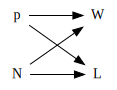

# Statistical Rethinking #2: The Garden of Forking Data

Hosted by Richard McElreath

## How much of the globe is covered by water?

- The estimand is proportion of surface water on Earth.
- We take a sample, create an estimate.

### Parameters

- $p$ is the proportion of water
- $N$ is the number of tosses
- $W$ is the number of water observations
- $L$ is the number of land observations

### DAG

$$W,L = f(p, N)$$

## Bayesian Data Analysis

> For each possible explanation of the sample, count all the ways the sample
> could happen. Explanations with more ways to produce the sample are more
> plausible.

