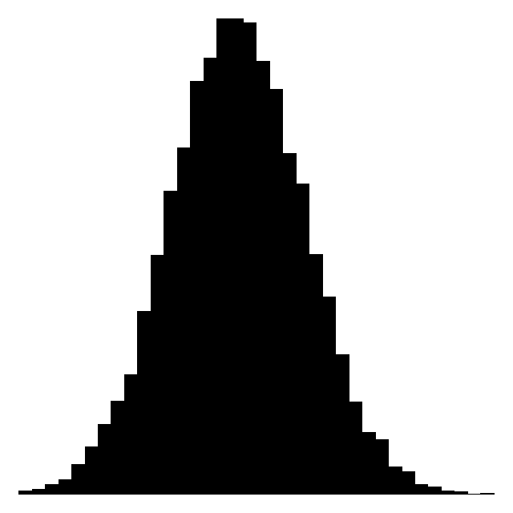
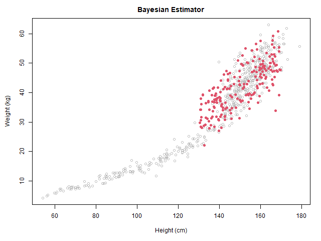

# Statistical Rethinking #3: Geocentric Models

Hosted by Richard McElreath

1. [Statistical Rethinking #3: Geocentric Models](#statistical-rethinking-3-geocentric-models)
   1. [Goals](#goals)
   1. [Workflow](#workflow)
   1. [Intro](#intro)
      1. [Planets](#planets)
         1. [Geocentric Model](#geocentric-model)
         1. [Heliocentric Model](#heliocentric-model)
      1. [Comets](#comets)
   1. [Linear Regression](#linear-regression)
      1. [Why Normal?](#why-normal)
      1. [Describing Models](#describing-models)
      1. [Estimator](#estimator)

## Goals

1. Language for representing models
1. Calculate posterior distributions with multiple unknowns
1. Constructing, understanding linear models

## Workflow

1. State a question
1. Sketch assumptions
1. Define generative model
1. Build an estimator
1. Refine

## Intro

### Planets

Planets, or "wanderers," appear to reverse course in their orbits when you
track their positions. Why is this?

#### Geocentric Model

> Prediction without causation.

Earth is the center of the universe. The planets are on epicycles, or "orbits
on orbits." Ptolemy and others were able to make correct observations using
this model.

Fails to predict other observations about the universe.

#### Heliocentric Model

Earth's orbit is within Mars's. The perception of Mars on the galactic backdrop
_appears_ to reverse course.

### Comets

Giuseppe Piazzi was able to track a comet. Got sick and lost track. The hunt
was on to find it again. It was actually Ceres, a dwarf planet between Mars and
Jupiter, not on the same elliptical plane.

Carl Friedrich Gauss found it again! Used a normal error model, least-squares
estimation, and Bayesian arguments. The Gaussian distribution.

## Linear Regression

Mechanistically silent, or in other words can be applied to anything, so make
sure you are relating the model to real-world mechanisms. Useful when carefully
handled.

Special Cases

- ANOVA
- ANCOVA
- t-test

### Why Normal?

{ width=33% }

1. Generative: Summed fluctuations tend towards Gaussian distributions.
1. Inferential: Mean and variance are best used with Gaussian (maxent).

> A distribution is considered to be least informative or maximally unbiased
> when it has the maximum entropy among all the distributions that satisfy a
> given set of constraints. In other words, it assigns equal probability to all
> events that are consistent with the constraints, and doesn't assign any
> probability to events that are not consistent with the constraints.

### Describing Models

1. List variables
1. Define variables as function of others (deterministic or distributional)

### Estimator

$$E(W_i|H_i) = \alpha + \beta H_i$$

